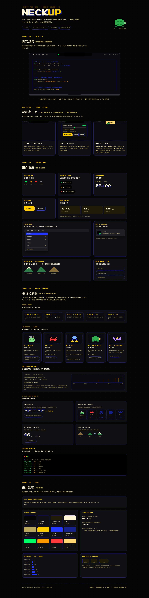

# NeckUp for Mac

> 脖子曲度变直这件事，自己是感觉不到的。NeckUp 让 AirPods 替你知道。

长时间伏案的打工人里，颈椎生理曲度变直（"军姿颈"）越来越常见——它不是某天突然低头低出来的，而是每天几小时、自己完全觉知不到的慢性前倾堆出来的。等到脖子酸痛时，曲度往往已经变了。

NeckUp 是一个 macOS 灵动岛应用：用 AirPods 里的运动传感器实时感知头部前倾，在你**自己察觉不到的时候**轻轻提醒，并在休息时带你用 60 秒头控小游戏把脖子活动开。



## 它是怎么工作的

- 刘海两侧常驻一颗呼吸圆点：绿 = 挺好，黄 = 有点低，红 = 该抬头了——不用点开，余光就能感知
- 低头持续几秒后，岛变成暖黄色轻轻提醒；连续无视会降级为系统通知，不烦人
- 25+5 番茄钟：专注时传感器全速监测，休息 5 分钟岛上开一局**头控打怪小游戏**——五只"僵硬怪"对应五个方向的颈部舒缓动作（点头、转头、侧屈、收下巴、复合），赢了得水滴浇山
- 不给角度数值、不给评分焦虑：只告诉你"状态好不好、该不该抬头"，零学习成本

## 功能

- **姿势监测**：CMHeadphoneMotionManager 读取 AirPods 头部姿态，戴上自动校准，摘下自动暂停
- **低头提醒**：灵敏度三档可调（严格/标准/宽松），温和文案轮换，连续无视自动降级 + 静默
- **番茄钟**：收缩态显示倒计时，结束系统通知
- **休息段微游戏**：洗牌式随机遭遇，60s 一局；动作幅度全部经过安全限幅（甩头会被拒绝并提示"慢一点 🐢"），渐进棘轮音效引导到位感；可在设置关闭
- **成长系统**：水滴浇山（秃山 → 青山 → 雪峰），五怪图鉴星级；佛系模式可关掉枯萎机制
- **当日统计**：良好时长、低头次数、专注时长，本地 JSON 落盘，不出本机

## 安装

**Homebrew（推荐）**

```bash
brew install --cask mikkley/neckup/neckup
```

**手动下载**

从 [Releases](https://github.com/mikkley/neckup/releases) 下载 `NeckUp-macOS.zip`，解压后拖入「应用程序」。

> 首次打开如提示「无法验证开发者」（ad-hoc 签名、未公证的正常现象）：右键 App → 打开，或终端执行 `xattr -dr com.apple.quarantine /Applications/NeckUp.app`。首次运行需授予**「运动与健身」**权限（读取 AirPods 头部运动数据）。

## 从源码构建

```bash
# 编译验证 + 跑测试
swift build && swift test

# 打包 NeckUp.app（release 构建 + ad-hoc 签名）
bash scripts/build-app.sh
open NeckUp.app

# 无 AirPods 开发预览：模拟波形数据
./NeckUp.app/Contents/MacOS/NeckUp --mock
```

## 系统要求

- macOS 14 Sonoma 及以上（`CMHeadphoneMotionManager` 硬性要求）
- AirPods Pro（1 代+）/ AirPods（3 代）/ AirPods Max / Beats Fit Pro
- 首次运行需授予**「运动与健身」**权限（读取 AirPods 头部运动数据）

## 技术说明

- 纯 SwiftPM 工程，无 .xcodeproj：`NeckUp`（AppKit/SwiftUI UI 与传感器）+ `NeckUpCore`（纯游戏/统计逻辑，XCTest 覆盖）
- 功耗：非番茄钟时段传感器 0.5Hz 低频上报，专注/对局才恢复 25Hz
- 隐私：所有数据只存在本机 `~/Library/Application Support/NeckUp/`

## 已知限制

- 头部俯仰 ≠ 探颈，本应用不做医学宣称；有颈椎病史请先咨询医生
- 当前为本地 ad-hoc 签名；分发需要 Developer ID + 公证
- 未实现：周/月统计视图、勿扰规则

## 开源

免费开源，欢迎 issue 和 PR。

## 支持 NeckUp

如果它帮你抬起了头，可以请作者喝杯咖啡 ☕

- **美元**：[Buy Me a Coffee](https://buymeacoffee.com/mikeyzhou)
- **人民币**：[支付宝 / 微信支付收款码](docs/donate.md)
